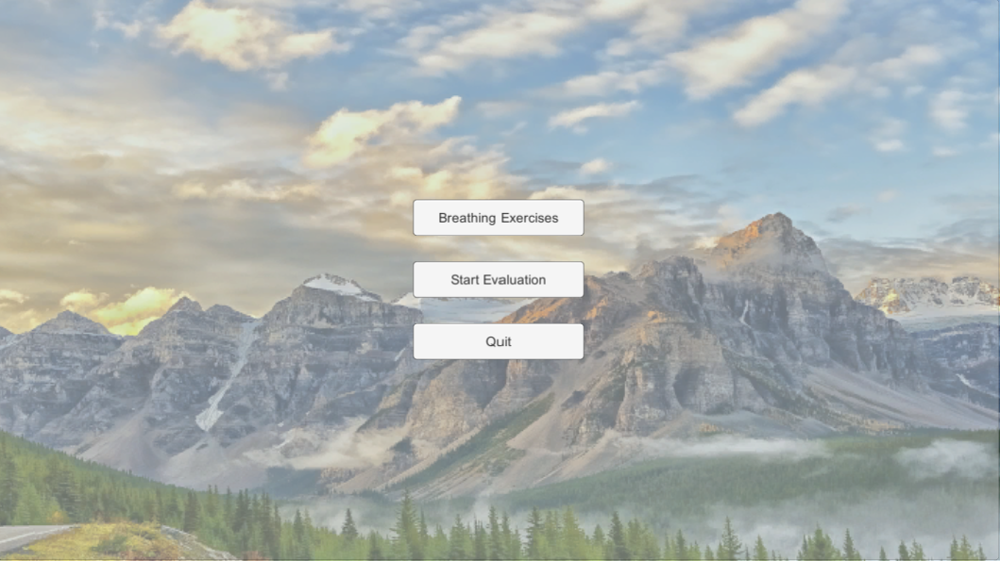
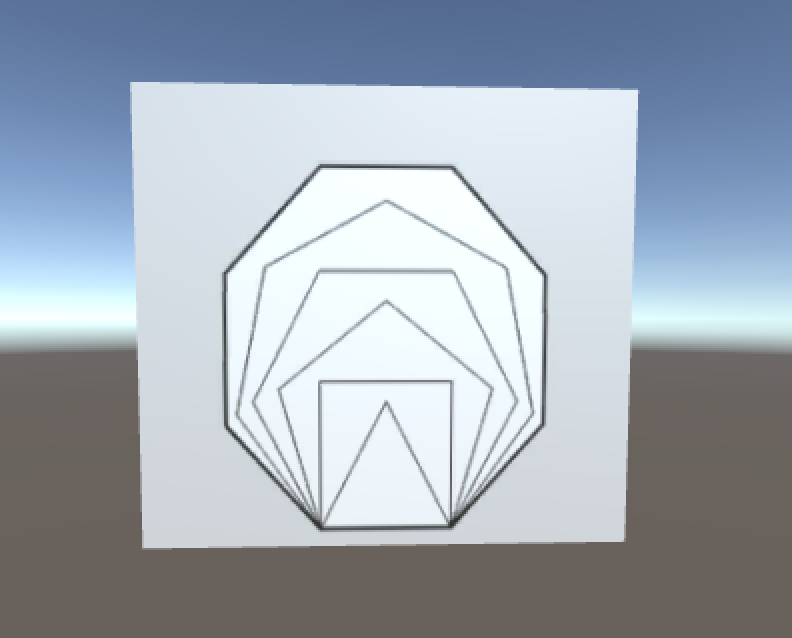
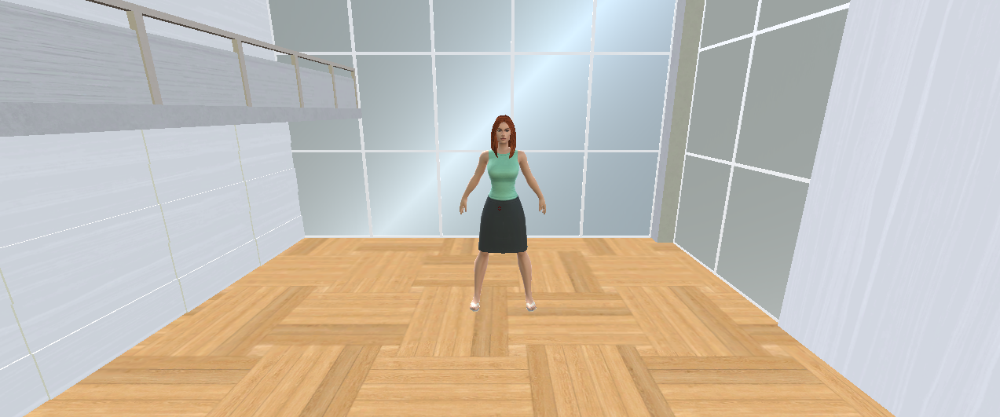

# VR Mindfulness: Patient VR Application

## About

### The VR Mindfulness Project

The ER is known for being a very stressful place, for patients and staff alike. High levels of stress reduce focus, which is extremely important when dealing with something as critical as an ER patient’s health. Since meditation is becoming an increasingly popular form of stress relief, we decided to bring this ancient practice to the high-stakes environment of ER. 

This project has two high level components: a VR mindfulness application for ER patients to use while sitting in the waiting room and a website for ER staff to view data submitted to the application by patients. Using the VR application, patients go through a series of meditative exercise to reduce stress, as well as help them identify the symptoms they are feeling. The central component of the VR application is the 3D body visual, which asks patients to select all the areas on their body that are in pain or discomfort.

The symptom data that patients enter in the VR app is transferred to a database and can be later viewed by ER staff to help diagnose patients. The web component of this project provides an interface for ER staff to view, update, and otherwise manage patient data.

## The VR Application

The application has three scenes: A main menu, a guided breathing exercise scene, and 3D body visual scene.

### Code

You can find the code for our three scenes in the compressed unity file linked below. You must have the most recent version of Unity downloaded to be able to run these files.

https://umich.box.com/s/m5455iflon4z11hkw43i1hvghua8fovc

### Screenshots

The application begins with the main menu, which shows the patient a few options displayed against a relaxing background.

The patient has the option to view an animation that encourages the user to breathe slowly and deeply. 

The application also provides a 3D body visual. The patient can click parts of the visual to indicate the areas of the body in which they are feeling pain.

